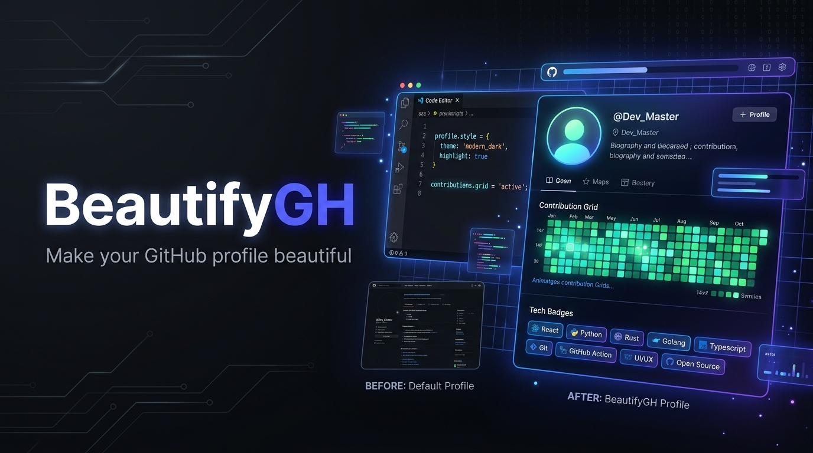
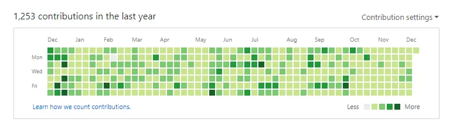

<div align="center">

  

  <picture>
    <source media="(prefers-color-scheme: dark)" srcset="https://capsule-render.vercel.app/api?type=waving&color=gradient&customColorList=2,3,5&height=190&section=header&text=Make%20Ur%20GitHub%20Profile%20Beautiful%20✨&fontSize=38&fontAlignY=38&desc=The%20Modern%20Guide,%20Templates,%20and%20Automations%20for%20GitHub%20Profiles&descAlignY=58&descAlign=50&theme=dark" />
    <source media="(prefers-color-scheme: light)" srcset="https://capsule-render.vercel.app/api?type=waving&color=gradient&customColorList=24,28,30&height=190&section=header&text=Make%20Ur%20GitHub%20Profile%20Beautiful%20✨&fontSize=38&fontAlignY=38&desc=The%20Modern%20Guide,%20Templates,%20and%20Automations%20for%20GitHub%20Profiles&descAlignY=58&descAlign=50&theme=light" />
    
  </picture>

  <p align="center">
    <b>🌟 "Make your GitHub profile beautiful"</b><br/>
    <i>A modern, curated open-source toolkit, battle-tested templates, and zero-bug GitHub Actions to elevate your developer presence.</i>
  </p>

  <p align="center">
    <a href="https://arsyadal.github.io/beautify-gh/"></a>
  </p>

  <p align="center">
    <a href="templates/ultimate-profile.md"></a>
    <a href=".github/workflows/snake-contribution.yml"></a>
    <a href="docs/dark-light-mode.md"></a>
    <a href="docs/custom-domain.md"></a>
    <a href="LICENSE"></a>
  </p>

</div>

---

## 📖 Table of Contents

- [🚀 Quick Start: Setup Your Profile in 60 Seconds](#-quick-start-setup-your-profile-in-60-seconds)
- [🌟 6 Essential Ready-to-Use Features](#-6-essential-ready-to-use-features)
  - [1. 🐍 Snake Contribution Grid Animation](#1--snake-contribution-grid-animation)
  - [2. 📊 Adaptive GitHub Stats & Top Languages](#2--adaptive-github-stats--top-languages)
  - [3. 🛠️ Curated & Categorized Tech Stack Badges](#3-️-curated--categorized-tech-stack-badges)
  - [4. 🚀 High-Signal Featured Projects Showcase](#4--high-signal-featured-projects-showcase)
  - [5. 🌐 Sleek Social & Contact Badges](#5--sleek-social--contact-badges)
  - [6. ✍️ Dynamic Blog Posts RSS Sync](#6-️-dynamic-blog-posts-rss-sync)
- [🎨 Curated Profile Templates](#-curated-profile-templates)
- [⚙️ Zero-Bug Automated GitHub Actions](#️-zero-bug-automated-github-actions)
- [💡 The Philosophy: 30 Minutes Every Day for Your Craft](#-the-philosophy-30-minutes-every-day-for-your-craft)
- [📚 Guides & Best Practices](#-guides--best-practices)
- [🤝 Contributing](#-contributing)

---

## 🚀 Quick Start: Setup Your Profile in 60 Seconds

1. Create a new **public repository** with the **exact same name as your GitHub username** (e.g., `https://github.com/username/username`).
2. Check the box **"Add a README file"**.
3. Open our master template **[`templates/ultimate-profile.md`](templates/ultimate-profile.md)** and copy its content into your repository's `README.md`.
4. Replace the placeholders (`YOUR_USERNAME`, `YOUR_NAME`, social links, and project showcases).
5. Copy the workflow file **[`.github/workflows/snake-contribution.yml`](.github/workflows/snake-contribution.yml)** to your `.github/workflows/` directory to enable automatic daily updates for the Snake contribution game!

---

## 🌟 6 Essential Ready-to-Use Features

### 1. 🐍 Snake Contribution Grid Animation
An animated snake eating through your GitHub contribution graph. Automatically adapts to Dark & Light themes:

```html
<div align="center">
  <picture>
    <source media="(prefers-color-scheme: dark)" srcset="https://raw.githubusercontent.com/YOUR_USERNAME/YOUR_USERNAME/output/github-snake-dark.svg" />
    <source media="(prefers-color-scheme: light)" srcset="https://raw.githubusercontent.com/YOUR_USERNAME/YOUR_USERNAME/output/github-snake.svg" />
    
  </picture>
</div>
```
*Generated automatically every midnight via [`.github/workflows/snake-contribution.yml`](.github/workflows/snake-contribution.yml).*

---

### 2. 📊 Adaptive GitHub Stats & Top Languages
Real-time activity stats and language distribution cards that automatically match the visitor's GitHub theme:

```html
<div align="center">
  <picture>
    <source media="(prefers-color-scheme: dark)" srcset="https://github-readme-stats-eight-theta.vercel.app/api?username=YOUR_USERNAME&show_icons=true&theme=tokyonight&hide_border=true&count_private=true" />
    <source media="(prefers-color-scheme: light)" srcset="https://github-readme-stats-eight-theta.vercel.app/api?username=YOUR_USERNAME&show_icons=true&theme=default&hide_border=true&count_private=true" />
    
  </picture>
  <picture>
    <source media="(prefers-color-scheme: dark)" srcset="https://github-readme-stats-eight-theta.vercel.app/api/top-langs/?username=YOUR_USERNAME&layout=compact&theme=tokyonight&hide_border=true" />
    <source media="(prefers-color-scheme: light)" srcset="https://github-readme-stats-eight-theta.vercel.app/api/top-langs/?username=YOUR_USERNAME&layout=compact&theme=default&hide_border=true" />
    
  </picture>
</div>
```

---

### 3. 🛠️ Curated & Categorized Tech Stack Badges
Professionally grouped per architectural layer (Frontend, Backend, Databases, Cloud & DevOps) to eliminate badge clutter:

```html
<table>
  <tr>
    <td align="center" width="140"><b>Frontend</b></td>
    <td></td>
  </tr>
  <tr>
    <td align="center" width="140"><b>Backend</b></td>
    <td></td>
  </tr>
  <tr>
    <td align="center" width="140"><b>Databases</b></td>
    <td></td>
  </tr>
  <tr>
    <td align="center" width="140"><b>DevOps & Tools</b></td>
    <td></td>
  </tr>
</table>
```

---

### 4. 🚀 High-Signal Featured Projects Showcase
A clean, responsive table highlighting the problem, engineering solution, tech stack, and direct live demo links for recruiters:

```markdown
| Project | Description & Impact | Tech Stack | Quick Links |
| :--- | :--- | :--- | :---: |
| **⚡ Project Alpha** | High-performance dashboard with real-time analytics. | `Next.js` `TypeScript` `PostgreSQL` | [Live Demo →](https://example.com) • [Source](https://github.com/YOUR_USERNAME) |
| **🛡️ Cloud Engine** | API Gateway featuring token-bucket rate limiting and caching. | `Go` `Redis` `Docker` `gRPC` | [Live Demo →](https://example.com) • [Source](https://github.com/YOUR_USERNAME) |
```

---

### 5. 🌐 Sleek Social & Contact Badges
Minimalist, high-contrast flat-square buttons for seamless networking:

```html
<p align="center">
  <a href="https://linkedin.com/in/YOUR_LINKEDIN"></a>
  <a href="https://twitter.com/YOUR_TWITTER"></a>
  <a href="https://YOUR_PORTFOLIO.com"></a>
  <a href="mailto:YOUR_EMAIL@example.com"></a>
</p>
```

---

### 6. ✍️ Dynamic Blog Posts RSS Sync
Automatically stream your latest articles from Medium, Dev.to, Hashnode, Substack, or any RSS feed:

```markdown
### ✍️ Recent Blog Posts
<!-- BLOG-POST-LIST:START -->
<!-- Automatically updated via GitHub Actions -->
<!-- BLOG-POST-LIST:END -->
```
*Synced automatically via [`.github/workflows/blog-post-sync.yml`](.github/workflows/blog-post-sync.yml).*

---

### 7. 🎬 Aesthetic Developer GIFs & Animations
Add dynamic personality to your header using lightweight, high-framerate GIFs:

| Style / Preset | Preview & Theme | Markdown Code |
| :--- | :--- | :--- |
| **🤞 Gojo Satoru (JJK)** | Jujutsu Kaisen Unlimited Void / Gojo animation | `` |
| **🌸 Lofi Study Girl** | Cozy Japanese anime study room & chill beats | `` |
| **🎧 Music Anime Girl** | Aesthetic anime girl enjoying music in headphones | `` |
| **🌃 City Lights Girl** | Anime girl looking at glowing Tokyo cityscape | `` |
| **🪟 Rainy Window Girl** | Melancholic rainy day anime window aesthetic | `` |
| **🍜 Anime Ramen** | Aesthetic Japanese ramen & late night coding | `` |
| **🌆 Tokyo Sunset Girl** | Cyberpunk neon dusk over Shinjuku | `` |
| **⚔️ Cyber Anime Girl** | Fast typing cyber terminal animation | `` |
| **🐱 Cat & Laptop** | Cute anime kitten resting on keyboard | `` |

*💡 Tip: You can paste any custom anime GIF URL from Giphy directly into our Web Generator.*

---

## 🎨 Curated Profile Templates

| Template Name | Design Aesthetic | Template File |
| :--- | :--- | :--- |
| **🌟 Ultimate All-in-One** | **Combines all 6 features** + Streak Stats + Spotify Status. | [`templates/ultimate-profile.md`](templates/ultimate-profile.md) |
| **🌸 Anime / Lofi Dev** | Sakura pastel gradients, anime quotes, lofi GIF header & Rose Pine theme. | [`templates/anime-lofi.md`](templates/anime-lofi.md) |
| **✨ Modern Minimalist** | Clean typography, dark/light adaptive cards, high signal-to-noise ratio. | [`templates/modern-minimalist.md`](templates/modern-minimalist.md) |
| **💻 Full-Stack Engineer** | Structured case study layouts, performance metrics, and categorized stack. | [`templates/fullstack-engineer.md`](templates/fullstack-engineer.md) |
| **📟 Terminal / Retro CLI** | Linux terminal prompts, Neovim aesthetics, and ASCII art headers. | [`templates/terminal-dev.md`](templates/terminal-dev.md) |

---

## ⚙️ Zero-Bug Automated GitHub Actions

All workflows are built against modern GitHub Actions standards (`permissions: contents: write`, non-deprecated actions, optimized cron schedules):

1. **[`.github/workflows/snake-contribution.yml`](.github/workflows/snake-contribution.yml)** — Generates contribution snake SVGs (Light & Dark theme).
2. **[`.github/workflows/blog-post-sync.yml`](.github/workflows/blog-post-sync.yml)** — Daily automated RSS blog article synchronization.
3. **[`.github/workflows/profile-3d-contrib.yml`](.github/workflows/profile-3d-contrib.yml)** — Isometric 3D contribution graph generator.

---

## 💡 The Philosophy: 30 Minutes Every Day for Your Craft

> *"We are what we repeatedly do. Excellence, then, is not an act, but a habit."* — Will Durant

<div align="center">
  
  <p><i>The power of dedicating 30+ minutes every day to sharpen your engineering skills (The Clean Coder ethos).</i></p>
</div>

---

## 📚 Guides & Best Practices

* 🎯 [Modern Best Practices & Avoiding Badge Fatigue](docs/best-practices.md)
* 🌓 [Dark & Light Mode Compatibility Guide](docs/dark-light-mode.md)
* 🛠️ [Troubleshooting Guide: Fixing 403 Errors, Rate Limits & Broken Images](docs/troubleshooting-faq.md)

---

## 🤝 Contributing

Contributions, template additions, and widget ideas are always welcome! Please review our [Contributing Guidelines](CONTRIBUTING.md).

---

<div align="center">
  <p>Released under the <a href="LICENSE">MIT License</a>.</p>
</div>
